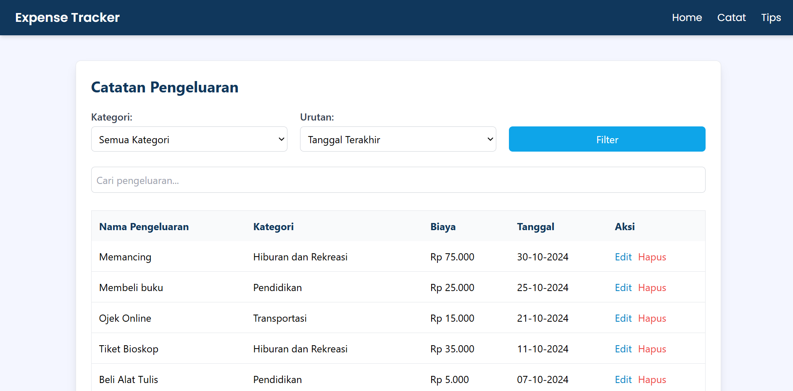

# Expense Tracker



<style>
  @media (min-width: 768px) {
    .container {
      display: flex;
      gap: 10px;
    }
    .responsive-img {
      width: 50%;
      max-width: 100%;
    }
  }
</style>

## Deskripsi Singkat

**Expense Tracker** adalah aplikasi web sederhana yang dirancang untuk membantu pengguna mencatat pengeluaran mereka secara efektif. Aplikasi ini dibangun menggunakan PHP untuk backend, dengan database SQL Server sebagai penyimpanan data. Aplikasi ini mencakup fungsi CRUD untuk mengelola pengeluaran serta komponen header dan footer yang dapat digunakan kembali.

---

## Fitur
- Menambah, melihat, mengedit, dan menghapus pengeluaran.
- Filter pengeluaran berdasarkan kategori.
- Sortir pengeluaran berdasarkan tanggal (terbaru atau terlama).
- Pencarian cepat pengeluaran dengan fitur live search.
- Menampilkan total pengeluaran secara dinamis.

---

## Teknologi yang Digunakan
[](https://developer.mozilla.org/en-US/docs/Web/HTML)
[](https://developer.mozilla.org/en-US/docs/Web/CSS)
[](https://tailwindcss.com)
[](https://api.jquery.com/)
[](https://www.php.net/)
- **Frontend**: HTML, CSS, TailwindCSS, jQuery
- **Backend**: PHP
- **Database**: SQL Server

---

## Cara Penggunaan

### Menambah Pengeluaran
1. Klik tombol `Tambah Pengeluaran` pada halaman utama.
2. Isi detail pengeluaran dan simpan.

### Melihat Pengeluaran
1. Halaman utama akan menampilkan daftar semua pengeluaran yang telah dicatat.
2. Gunakan filter kategori atau urutan tanggal untuk menyaring pengeluaran.
3. Gunakan fitur pencarian untuk menemukan pengeluaran tertentu.

### Mengedit Pengeluaran
1. Klik tombol `Edit` pada pengeluaran yang ingin diperbarui.
2. Perbarui detailnya dan simpan perubahan.

### Menghapus Pengeluaran
1. Klik tombol `Hapus` pada pengeluaran yang ingin dihapus.
2. Konfirmasi penghapusan.

### Total Pengeluaran
1. Total pengeluaran akan ditampilkan secara dinamis di bagian bawah daftar pengeluaran.

---

## Langkah-Langkah Instalasi

### 1. Clone Repository
Kloning proyek ke komputer lokal Anda:
```bash
git clone https://github.com/Atadewa/expense-tracker.git
```

### 2. Konfigurasi Database

Buat database baru di SQL Server:
```sql
CREATE DATABASE expense_tracker;
GO

USE expense_tracker;
GO

CREATE TABLE kategori (
    id_kategori CHAR(3) PRIMARY KEY,
    nama_kategori VARCHAR(255) NOT NULL
);

CREATE TABLE pengeluaran (
    id_pengeluaran INT IDENTITY PRIMARY KEY,
    id_kategori CHAR(3) NOT NULL,
    deskripsi VARCHAR(255) NOT NULL,
    biaya INT NOT NULL,
    tanggal DATE NOT NULL,
    FOREIGN KEY (id_kategori) REFERENCES kategori(id_kategori)
);
GO

INSERT INTO kategori (id_kategori, nama_kategori)
VALUES
  ('K01', 'Makanan dan Minuman'),
  ('K02', 'Pendidikan'),
  ('K03', 'Hiburan dan Rekreasi'),
  ('K04', 'Kesehatan'),
  ('K05', 'Transportasi');
GO
```

### 3. Perbarui Koneksi Database

Edit file `config/database.php` dengan kredensial SQL Server Anda:
```php
<?php
$serverName = "your_server_name";  // contoh: "localhost" atau "DESKTOP\SQLEXPRESS"
$connectionInfo = [
    "Database" => "expense_tracker",
    "Uid" => "username_anda",
    "PWD" => "password_anda"
];

$conn = sqlsrv_connect($serverName, $connectionInfo);

if ($conn === false) {
    die(print_r(sqlsrv_errors(), true));
}
?>
```

### 4. Jalankan Server
Jalankan server PHP dan navigasikan ke direktori proyek:
```bash
php -S localhost:8000
```
Akses aplikasi melalui `http://localhost:8000`.


